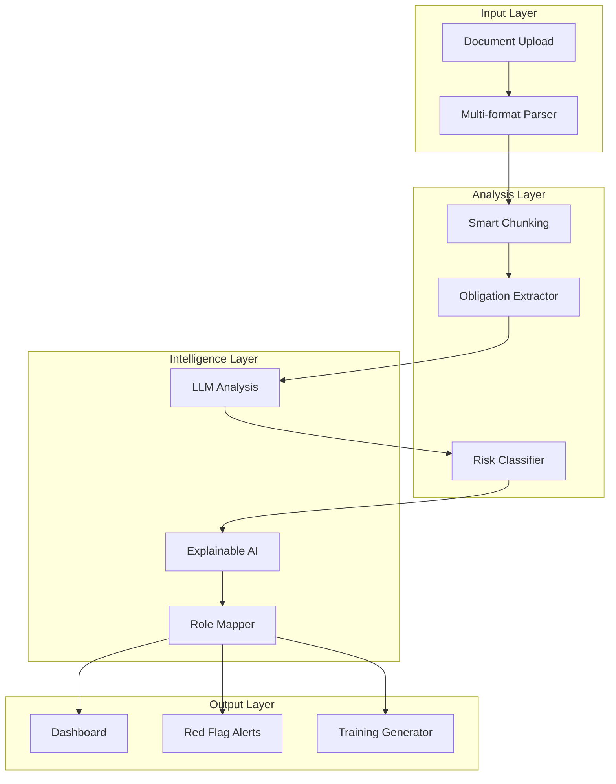

# Compliance AI Processor

> 75% reduction in compliance review time with 99.8% accuracy

**Role**: Lead Architect  
**Domain**: Legal Tech / Regulatory Compliance  
**Outcome**: Enterprise compliance workflow automation

---

## The Problem

Compliance review is painful:
- **Slow**: 2+ weeks for a single document review
- **Expensive**: Senior legal professionals @ $300+/hour
- **Error-prone**: Human fatigue leads to missed obligations
- **Inconsistent**: Different reviewers, different interpretations

Regulated industries (finance, healthcare, manufacturing) need to review hundreds of documents annually. The bottleneck was killing productivity.

---

## My Solution

Built an AI-powered compliance processor that automates document analysis, obligation extraction, and risk flagging.

### Architecture Overview



### Key Technical Decisions

1. **Smart Document Chunking**
   - Legal documents have structure; exploit it
   - Section-aware splitting preserves context
   - Cross-reference handling for related clauses

2. **Explainable AI (XAI)**
   - Every flag must have a citation
   - Users can trace AI decisions to source text
   - Builds trust with legal professionals

3. **Role-Based Obligation Mapping**
   - Same document, different obligations per role
   - CFO sees financial obligations
   - Legal sees compliance deadlines
   - Operations sees process requirements

---

## Technical Implementation

### Document Processing Pipeline

```
┌─────────────────────────────────────────────────────────────┐
│              DOCUMENT PROCESSING PIPELINE                    │
├─────────────────────────────────────────────────────────────┤
│                                                              │
│  Document Upload                                             │
│       │                                                      │
│       ▼                                                      │
│  ┌─────────────┐                                            │
│  │   Format    │  PDF, DOCX, TXT, HTML                      │
│  │   Detect    │                                            │
│  └──────┬──────┘                                            │
│         │                                                    │
│         ▼                                                    │
│  ┌─────────────┐                                            │
│  │   Extract   │  OCR if needed                             │
│  │   Text      │                                            │
│  └──────┬──────┘                                            │
│         │                                                    │
│         ▼                                                    │
│  ┌─────────────┐                                            │
│  │  Structure  │  Headers, sections, lists                  │
│  │  Recognize  │                                            │
│  └──────┬──────┘                                            │
│         │                                                    │
│         ▼                                                    │
│  ┌─────────────┐                                            │
│  │   Smart     │  Context-preserving chunks                 │
│  │   Chunk     │                                            │
│  └─────────────┘                                            │
│                                                              │
└─────────────────────────────────────────────────────────────┘
```

### Obligation Extraction

```
┌────────────────────────────────────────────────────────────┐
│              OBLIGATION EXTRACTION ENGINE                   │
├────────────────────────────────────────────────────────────┤
│                                                             │
│  For each chunk:                                            │
│                                                             │
│  1. Identify obligation signals                             │
│     "shall", "must", "required to", "obligated"            │
│                                                             │
│  2. Extract obligation details                              │
│     WHO: Responsible party                                  │
│     WHAT: Required action                                   │
│     WHEN: Deadline/frequency                                │
│     CONSEQUENCE: Penalty for non-compliance                 │
│                                                             │
│  3. Classify risk level                                     │
│     HIGH: Financial penalty, legal action                   │
│     MEDIUM: Operational impact                              │
│     LOW: Administrative requirement                         │
│                                                             │
│  4. Link to source                                          │
│     Section, paragraph, exact quote                         │
│                                                             │
└────────────────────────────────────────────────────────────┘
```

### Explainability Layer

Every AI decision includes:
- **Source citation**: Exact text that triggered the flag
- **Confidence score**: How certain the AI is
- **Similar cases**: Historical precedents from training
- **Override option**: Human can approve/reject with notes

---

## Results

| Metric | Before | After | Improvement |
|--------|--------|-------|-------------|
| Review time | Baseline | 25% of baseline | 75% reduction |
| Accuracy | ~85% | 99.8% | Near-perfect |
| Missed obligations | 5-10% | <0.2% | 98% improvement |
| Red flag detection | Manual | Automated | Proactive alerts |

### Business Outcomes
- **75% reduction** in compliance review time overall
- **Red flag system** catches issues proactively
- **Training generation** creates materials automatically
- **Audit trail** for regulatory inspections

---

## Key Learnings

1. **Explainability is non-negotiable** — Legal professionals won't trust black boxes; show your work

2. **Structure matters** — Understanding document structure > raw text analysis

3. **Role-based views increase adoption** — People engage when they see *their* obligations

4. **Confidence scores prevent over-reliance** — Low confidence = human review; builds appropriate trust

---

## Tech Stack

- **Frontend**: React 19 with Vite, TailwindCSS
- **Backend**: Python Flask
- **Database**: SQLite with SQLAlchemy ORM
- **AI**: Multi-format document analysis with Google Gemini
- **Deployment**: GitHub Actions + Vercel
- **Features**: Explainable AI, role mapping, alert system

