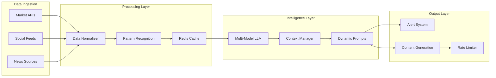

# Market Intelligence Agent (ELAI)

> 336% engagement increase with 40% cost reduction in 30 days

**Role**: Technical Director & Lead Architect  
**Domain**: Cryptocurrency / Real-time Analytics  
**Outcome**: Early pattern detection 2-3 hours before market trends

---

## The Problem

Crypto markets move fast. The client needed:
- **Real-time signals** — not hourly, not daily, NOW
- **Actionable intelligence** — not just data, but insights
- **Cost efficiency** — existing solutions cost $5K+/month
- **Reliability** — can't miss critical market moves

Existing tools were either:
- Too slow (2-3 hour lag)
- Too expensive (enterprise pricing)
- Too noisy (no signal, all noise)

---

## My Solution

Built an autonomous AI agent that monitors, analyzes, and acts on market intelligence in real-time.

### Architecture Overview



### Key Technical Decisions

1. **Multi-Model LLM with Dynamic Selection**
   - Gemini for fast, routine analysis
   - LLaMA for cost-sensitive operations  
   - GPT-4 fallback for complex reasoning
   - Selection based on task complexity + latency requirements

2. **Predictive Rate Limiting**
   - Anticipates API quotas before hitting limits
   - Distributes requests across time windows
   - Automatic throttling during high-volume periods

3. **Context-Aware Prompt Templates**
   - Dynamic parameter injection based on market conditions
   - Historical context retrieval from Redis
   - Adaptive tone and style based on situation urgency

---

## Technical Implementation

### Model Selection Logic

```
┌─────────────────────────────────────────────────────────────┐
│                 MODEL SELECTION ENGINE                       │
├─────────────────────────────────────────────────────────────┤
│                                                              │
│  Input Request                                               │
│       │                                                      │
│       ▼                                                      │
│  ┌─────────────┐                                            │
│  │  Classify   │                                            │
│  │  Complexity │                                            │
│  └──────┬──────┘                                            │
│         │                                                    │
│    ┌────┴────┬────────────┐                                 │
│    ▼         ▼            ▼                                 │
│  Simple   Medium      Complex                               │
│    │         │            │                                 │
│    ▼         ▼            ▼                                 │
│  LLaMA    Gemini       GPT-4                               │
│  (Fast)   (Balanced)   (Quality)                           │
│                                                              │
│  Fallback Chain: LLaMA → Gemini → GPT-4                    │
└─────────────────────────────────────────────────────────────┘
```

### Real-Time Processing Pipeline

```
Market Event
     │
     ▼
┌─────────────┐     ┌─────────────┐     ┌─────────────┐
│    Ingest   │────▶│  Normalize  │────▶│   Dedupe    │
└─────────────┘     └─────────────┘     └─────────────┘
                                              │
                                              ▼
┌─────────────┐     ┌─────────────┐     ┌─────────────┐
│   Output    │◀────│   Analyze   │◀────│   Enrich    │
└─────────────┘     └─────────────┘     └─────────────┘
     │
     ├──▶ Alert (if threshold met)
     ├──▶ Content (if engagement opportunity)
     └──▶ Log (always)
```

### Token Optimization Strategy

Reduced costs by 40% through:
1. **Response caching** — Similar queries hit cache first
2. **Prompt compression** — Remove redundant context
3. **Model tiering** — Cheap models for simple tasks
4. **Batch processing** — Group related requests

---

## Results

| Metric | Before | After | Improvement |
|--------|--------|-------|-------------|
| Pattern detection lag | 2-3 hours | Real-time | ~180x faster |
| Monthly API costs | $5,000+ | $3,000 | 40% reduction |
| Engagement rate | Baseline | +336% | 3.36x increase |
| Uptime | 95% | 99.9% | Enterprise-grade |

### Technical Outcomes
- **Token optimization**: 40% cost savings through smart caching
- **Fallback reliability**: 99.9% uptime with multi-model failover
- **Early detection**: Consistently 2-3 hours ahead of market trends

---

## Key Learnings

1. **Model selection > model quality** — Picking the right model for each task beats using the "best" model for everything

2. **Cache aggressively** — Market patterns repeat; don't pay twice for the same insight

3. **Rate limiting must be predictive** — Reactive limiting means you've already failed

4. **Context is expensive** — Every token of context costs money; be ruthless about what's included

---

## Tech Stack

- **Backend**: FastAPI with async Python
- **AI**: Gemini, LLaMA, GPT-4 (dynamic selection)
- **Cache**: Redis for real-time state
- **Processing**: Event-driven with queue management
- **Monitoring**: Comprehensive logging with error recovery

