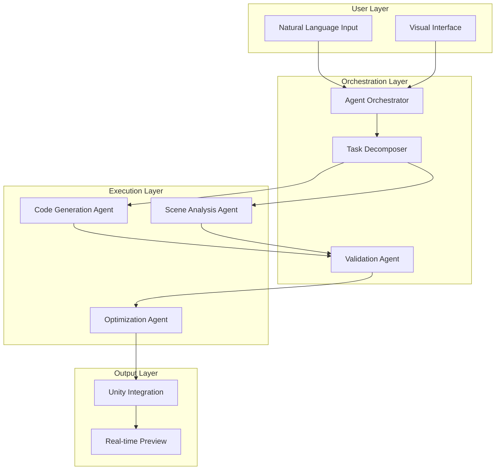

# Multi-Agent Game Development Platform (SculptAI)

> Reduced 6-developer, 1-month projects to 2-developer, few-day delivery

**Role**: Co-Founder & CTO  
**Domain**: Game Development / AI Automation  
**Outcome**: 70% reduction in development time with higher code quality

---

## The Problem

Traditional game development faces compounding challenges:
- **Slow iteration**: Small changes require extensive manual coding
- **High cost**: Large teams needed for even basic game mechanics
- **Quality variance**: Output depends heavily on individual developer skill
- **Barrier to entry**: Non-technical creators can't participate

Clients were spending **6+ developers for 4-6 weeks** on projects that should be simpler.

---

## My Solution

Built a multi-agent AI system that transforms natural language into working game code:

### Architecture Overview



### Key Technical Decisions

1. **Multi-Model LLM Integration**
   - GPT-4 for complex reasoning and code generation
   - Gemini for scene analysis and visual understanding
   - LLaMA for fast iteration and drafting

2. **Command Pattern Architecture**
   - Every action is reversible
   - Full audit trail of changes
   - Enables "undo" at any granularity

3. **Agent Specialization**
   - Code Generation Agent: Handles Unity C# output
   - Scene Analysis Agent: Understands spatial relationships
   - Validation Agent: Ensures output compiles and runs
   - Optimization Agent: Refactors for performance

---

## Technical Implementation

### Agent Communication Protocol

```
┌─────────────────────────────────────────────────────────────┐
│                    ORCHESTRATOR                              │
│  ┌─────────┐    ┌─────────┐    ┌─────────┐    ┌─────────┐  │
│  │ Intent  │───▶│  Plan   │───▶│ Execute │───▶│ Verify  │  │
│  │ Parser  │    │ Builder │    │ Agents  │    │ Output  │  │
│  └─────────┘    └─────────┘    └─────────┘    └─────────┘  │
└─────────────────────────────────────────────────────────────┘
                           │
          ┌────────────────┼────────────────┐
          ▼                ▼                ▼
    ┌──────────┐    ┌──────────┐    ┌──────────┐
    │   Code   │    │  Scene   │    │  Asset   │
    │  Agent   │    │  Agent   │    │  Agent   │
    └──────────┘    └──────────┘    └──────────┘
```

### Self-Correction Loop

The system implements automatic error recovery:
1. Generate initial code
2. Attempt compilation
3. If errors → analyze error messages → regenerate
4. Max 3 retry attempts before human escalation
5. Learn from corrections to improve future output

---

## Results

| Metric | Before | After | Improvement |
|--------|--------|-------|-------------|
| Team size | 6 developers | 2 developers | 66% reduction |
| Project duration | 4-6 weeks | 3-5 days | 85% faster |
| Code quality | Variable | Consistent high | Measurable improvement |
| Iteration speed | Hours | Minutes | 10x faster |

### Business Outcomes
- Currently **raising $350K at $4.8M FDV** (seed round)
- Established partnerships with major tech players
- Enabled non-technical users to create games
- Higher code quality than traditional development

---

## Key Learnings

1. **Agent specialization beats generalization** — Dedicated agents for specific tasks outperform one "do-everything" agent

2. **Validation is non-negotiable** — Every generated output must be verified before delivery

3. **Command pattern enables confidence** — Users experiment more when they can undo

4. **Multi-model is worth the complexity** — Right model for right task beats one-size-fits-all

---

## Tech Stack

- **AI**: GPT-4, Gemini, LLaMA (multi-model orchestration)
- **Game Engine**: Unity with C# code generation
- **Architecture**: Multi-agent with task decomposition
- **Patterns**: Command pattern, self-correction loops

