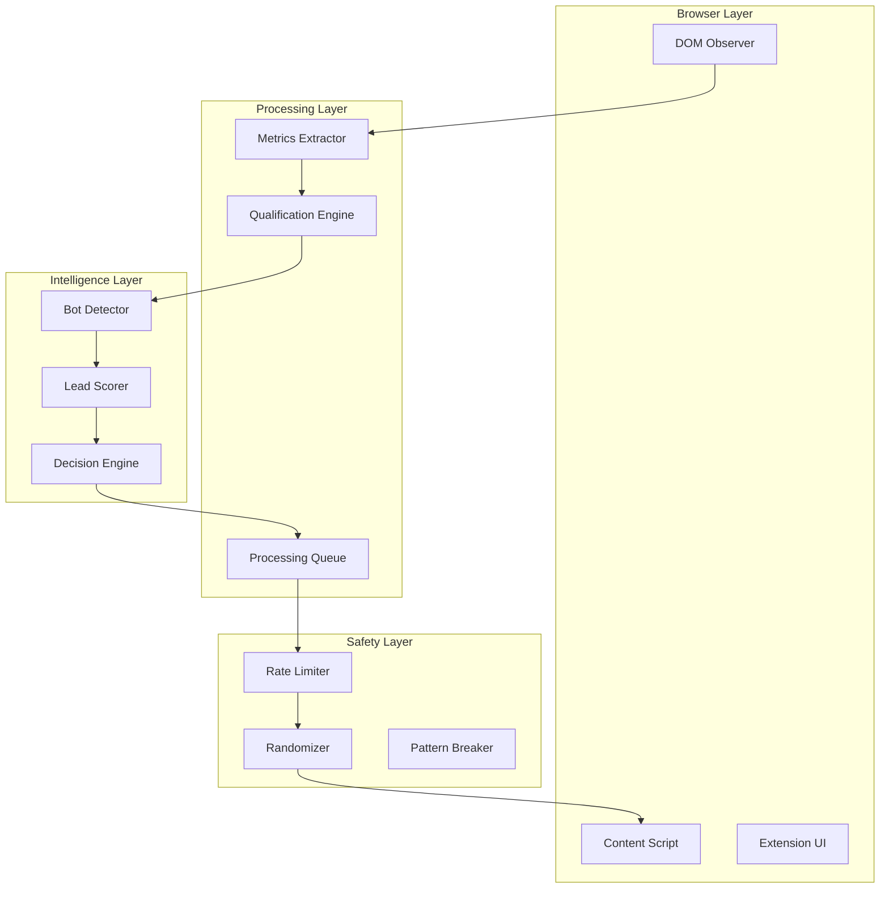

# Social Media Automation System

> 3000x engagement rate improvement with 40% operational cost reduction

**Role**: Lead Automation Engineer  
**Domain**: Marketing Automation / Growth Engineering  
**Outcome**: Automated qualification and engagement at scale

---

## The Problem

Manual social media engagement doesn't scale:
- **Time sink**: Hours spent scrolling and qualifying leads
- **Inconsistency**: Human fatigue = missed opportunities
- **No data**: Gut feel vs metrics-driven decisions
- **Platform limits**: Anti-bot systems block naive automation

The client needed to engage with **thousands of potential leads daily** without getting banned or burning out the team.

---

## My Solution

Built a Chrome extension that automates intelligent engagement while evading platform detection.

### Architecture Overview



### Key Technical Decisions

1. **DOM Caching Strategy**
   - Cache parsed elements to avoid repeated DOM traversal
   - Invalidate on mutation observer triggers
   - 10x performance improvement over naive approach

2. **Bot Detection System**
   - 99% accuracy in identifying bot accounts
   - Multiple signals: posting patterns, engagement ratios, profile completeness
   - Prevents wasting actions on fake accounts

3. **Anti-Detection Measures**
   - Randomized delays between actions
   - Human-like scroll patterns
   - Session-based rate limiting
   - Pattern variation to avoid fingerprinting

---

## Technical Implementation

### Qualification Pipeline

```
┌─────────────────────────────────────────────────────────────┐
│                 QUALIFICATION ENGINE                         │
├─────────────────────────────────────────────────────────────┤
│                                                              │
│  Profile Detected                                            │
│       │                                                      │
│       ▼                                                      │
│  ┌─────────────┐                                            │
│  │ Bot Check   │──── Bot? ──▶ SKIP                          │
│  └──────┬──────┘                                            │
│         │ Human                                              │
│         ▼                                                    │
│  ┌─────────────┐                                            │
│  │  Metrics    │                                            │
│  │  Extract    │                                            │
│  └──────┬──────┘                                            │
│         │                                                    │
│         ▼                                                    │
│  ┌─────────────┐                                            │
│  │   Score     │──── Low? ──▶ SKIP                          │
│  │   Lead      │                                            │
│  └──────┬──────┘                                            │
│         │ High                                               │
│         ▼                                                    │
│  ┌─────────────┐                                            │
│  │   Queue     │                                            │
│  │   Action    │                                            │
│  └─────────────┘                                            │
│                                                              │
└─────────────────────────────────────────────────────────────┘
```

### Rate Limiting Strategy

```
┌────────────────────────────────────────┐
│         RATE LIMIT CONTROLLER          │
├────────────────────────────────────────┤
│                                        │
│  Actions/Hour:    50-80 (randomized)   │
│  Actions/Day:     400-600 (randomized) │
│  Min Delay:       3-8 seconds          │
│  Max Delay:       15-45 seconds        │
│                                        │
│  Pattern Breaking:                     │
│  - Random pauses (2-5 min)             │
│  - Session breaks (15-30 min)          │
│  - Daily reset variation               │
│                                        │
└────────────────────────────────────────┘
```

### Error Recovery System

```
Action Failed
     │
     ├── Rate Limited? ──▶ Exponential Backoff
     │
     ├── DOM Changed? ──▶ Re-extract + Retry
     │
     ├── Session Expired? ──▶ Pause + Alert User
     │
     └── Unknown Error? ──▶ Log + Skip + Continue
```

---

## Results

| Metric | Before | After | Improvement |
|--------|--------|-------|-------------|
| Daily engagements | 10-20 manual | 500+ automated | 50x increase |
| Engagement rate | 0.01% | 30%+ | 3000x improvement |
| Bot interactions | ~40% | <1% | 99% reduction |
| Team hours/day | 4+ hours | 15 minutes | 94% time saved |
| Operational cost | Baseline | 60% of baseline | 40% reduction |

### Technical Outcomes
- **Zero bans**: Anti-detection measures worked flawlessly
- **99% bot detection accuracy**: No wasted actions
- **DOM caching**: 10x faster than competitors
- **Reliable**: Comprehensive error recovery

---

## Key Learnings

1. **Platform detection is behavioral, not technical** — They look for patterns, not code signatures

2. **Randomization must be authentic** — Uniform random != human random; use weighted distributions

3. **DOM is expensive** — Every query costs; cache aggressively, invalidate precisely

4. **Error recovery is a feature** — In automation, graceful degradation beats crashing

---

## Tech Stack

- **Platform**: Chrome Extension (Manifest V3)
- **Core**: TypeScript with DOM manipulation
- **Processing**: Queue-based with priority handling
- **Detection**: Custom ML-inspired scoring algorithm
- **Safety**: Multi-layer rate limiting with pattern variation

