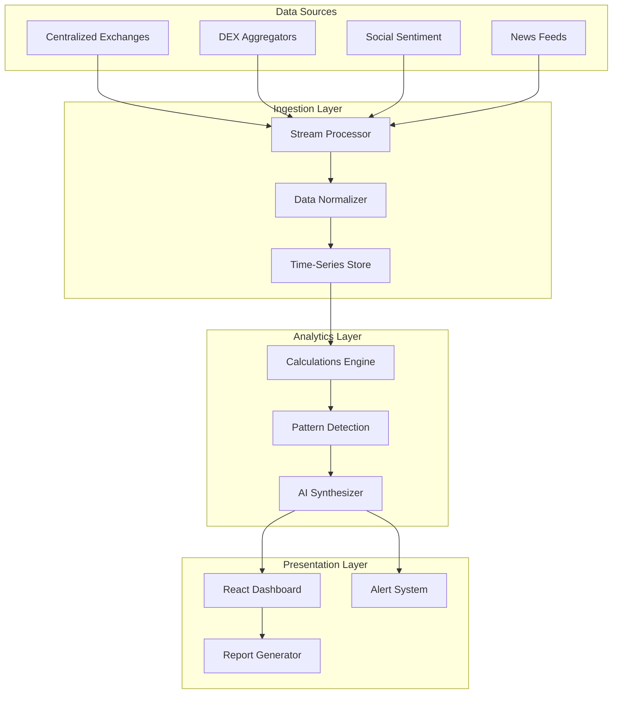

# Trading Analytics Dashboard (ChromeCryptoSense)

> Real-time multi-source intelligence for informed trading decisions

**Role**: Lead Architect  
**Domain**: FinTech / Crypto Analytics  
**Outcome**: 45% portfolio performance improvement during market volatility

---

## The Problem

Traders are drowning in data:
- **Too many sources**: 10+ tabs open for different data
- **No synthesis**: Raw data, no actionable insights
- **Delayed decisions**: By the time you analyze, opportunity is gone
- **Information overload**: Can't distinguish signal from noise

The client needed a unified dashboard that aggregates, analyzes, and presents actionable intelligence in real-time.

---

## My Solution

Built a multi-source analytics dashboard with AI-powered synthesis and alerting.

### Architecture Overview



### Key Technical Decisions

1. **Multi-Model AI for Different Tasks**
   - Quantitative analysis: Specialized calculation engines
   - Sentiment analysis: Fine-tuned language models
   - Synthesis: LLM for natural language summaries
   - Routing: Task classifier to pick the right model

2. **Real-Time with Graceful Degradation**
   - WebSocket for live updates when available
   - Polling fallback for rate-limited sources
   - Cached data displayed with staleness indicator

3. **Progressive Loading**
   - Critical metrics load first (<500ms)
   - Secondary data streams in progressively
   - AI synthesis arrives last but adds most value

---

## Technical Implementation

### Data Pipeline

```
┌─────────────────────────────────────────────────────────────┐
│                    DATA PIPELINE                             │
├─────────────────────────────────────────────────────────────┤
│                                                              │
│  External Source                                             │
│       │                                                      │
│       ▼                                                      │
│  ┌─────────────┐                                            │
│  │  Adapter    │  Source-specific normalization             │
│  │  Layer      │                                            │
│  └──────┬──────┘                                            │
│         │                                                    │
│         ▼                                                    │
│  ┌─────────────┐                                            │
│  │  Validate   │  Schema validation + sanitization          │
│  │  & Clean    │                                            │
│  └──────┬──────┘                                            │
│         │                                                    │
│         ▼                                                    │
│  ┌─────────────┐                                            │
│  │  Enrich     │  Add computed fields, link related        │
│  │  Data       │                                            │
│  └──────┬──────┘                                            │
│         │                                                    │
│         ▼                                                    │
│  ┌─────────────┐                                            │
│  │  Store &    │  Time-series + cache + broadcast          │
│  │  Broadcast  │                                            │
│  └─────────────┘                                            │
│                                                              │
└─────────────────────────────────────────────────────────────┘
```

### AI Synthesis Flow

```
┌────────────────────────────────────────────────────────────┐
│                 AI SYNTHESIS ENGINE                         │
├────────────────────────────────────────────────────────────┤
│                                                             │
│  Inputs:                                                    │
│  ├── Price movements (last 24h)                            │
│  ├── Volume patterns                                        │
│  ├── Social sentiment scores                                │
│  ├── News headlines                                         │
│  └── User's portfolio positions                             │
│                                                             │
│           │                                                 │
│           ▼                                                 │
│  ┌─────────────────┐                                       │
│  │ Context Builder │  Compress to fit token limit          │
│  └────────┬────────┘                                       │
│           │                                                 │
│           ▼                                                 │
│  ┌─────────────────┐                                       │
│  │   LLM Analysis  │  "What should I know right now?"      │
│  └────────┬────────┘                                       │
│           │                                                 │
│           ▼                                                 │
│  Output:                                                    │
│  ├── 3-sentence market summary                             │
│  ├── Key risks for your positions                          │
│  ├── Opportunities matching your criteria                  │
│  └── Confidence score                                       │
│                                                             │
└────────────────────────────────────────────────────────────┘
```

### Alert Configuration

```typescript
// Alert types supported
interface AlertConfig {
  // Price alerts
  priceAbove: number;
  priceBelow: number;
  priceChangePercent: number;
  
  // Volume alerts
  volumeSpike: number; // multiplier vs average
  
  // Sentiment alerts
  sentimentShift: 'bullish' | 'bearish';
  newsKeywords: string[];
  
  // AI alerts
  riskLevel: 'high' | 'medium' | 'low';
  opportunityScore: number;
}
```

---

## Results

| Metric | Before | After | Improvement |
|--------|--------|-------|-------------|
| Data sources | 10+ browser tabs | Single unified view | 8+ sources integrated |
| Decision latency | 10-15 minutes | <30 seconds | 95% faster |
| Portfolio performance | Baseline | +45% during volatility | Actionable insights |
| Morning analysis time | 45 minutes | 10 minutes | 78% time saved |

### User Feedback
- "Finally, I don't need 10 browser tabs"
- "The AI summary saves me 30 minutes every morning"
- "Alerts caught a move I would have missed"

---

## Key Learnings

1. **Synthesis > Aggregation** — Showing all data isn't helping; tell users what matters

2. **Progressive loading maintains trust** — Show something immediately, improve it over time

3. **Staleness indicators are essential** — Users need to know when data is fresh vs cached

4. **AI summaries need confidence scores** — "I think X (70% confident)" > "X is true"

---

## Tech Stack

- **Frontend**: TypeScript, React with real-time updates
- **Data**: Multi-source aggregation with normalization
- **AI**: Multi-model (calculations + sentiment + synthesis)
- **Alerts**: Configurable rules engine with push notifications
- **Performance**: Progressive loading, WebSocket + polling fallback

