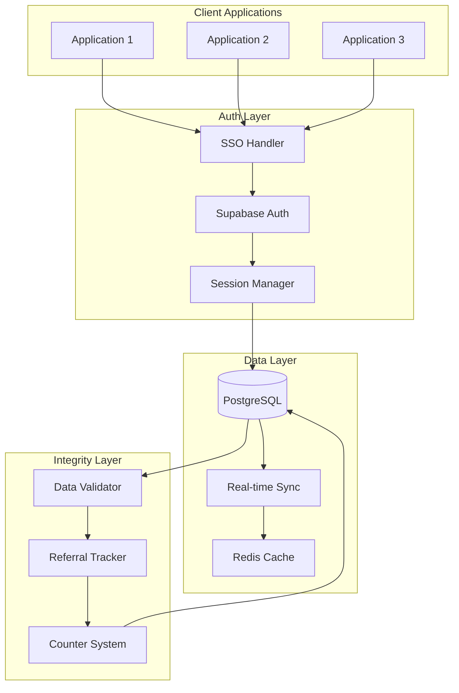

# User Verification Ecosystem (TAU Network)

> Scalable authentication serving 200,000+ community members

**Role**: Lead Systems Engineer  
**Domain**: Web3 / Identity / Authentication  
**Outcome**: Interconnected applications with unified identity

---

## The Problem

Fragmented user systems create chaos:
- **Multiple logins**: Users create separate accounts per app
- **Data silos**: User info scattered across databases
- **Referral tracking nightmare**: Can't attribute growth accurately
- **Inconsistent experience**: Different apps, different UX

The client had 200K+ community members across multiple applications with no unified identity system.

---

## My Solution

Built a centralized authentication and verification ecosystem with real-time synchronization.

### Architecture Overview



### Key Technical Decisions

1. **Supabase as Central Auth**
   - Real-time subscriptions out of the box
   - Row-level security for data isolation
   - Built-in session management
   - Postgres for complex queries

2. **Event-Driven Synchronization**
   - Database triggers for real-time updates
   - Webhook distribution to applications
   - Eventual consistency with conflict resolution

3. **Counter System Optimization**
   - High-frequency counters (referrals, points) need special handling
   - Batched updates to prevent lock contention
   - Read replicas for dashboard queries

---

## Technical Implementation

### Session Management Flow

```
┌─────────────────────────────────────────────────────────────┐
│                 SESSION MANAGEMENT                           │
├─────────────────────────────────────────────────────────────┤
│                                                              │
│  User Login (Any App)                                        │
│       │                                                      │
│       ▼                                                      │
│  ┌─────────────┐                                            │
│  │  Supabase   │                                            │
│  │   Auth      │                                            │
│  └──────┬──────┘                                            │
│         │                                                    │
│         ▼                                                    │
│  ┌─────────────┐                                            │
│  │  Generate   │  JWT with claims                           │
│  │   Token     │                                            │
│  └──────┬──────┘                                            │
│         │                                                    │
│         ▼                                                    │
│  ┌─────────────┐                                            │
│  │  Broadcast  │  All connected apps notified               │
│  │   Session   │                                            │
│  └──────┬──────┘                                            │
│         │                                                    │
│    ┌────┴────┬────────┐                                     │
│    ▼         ▼        ▼                                     │
│  App 1    App 2    App 3                                    │
│  (Logged) (Logged) (Logged)                                 │
│                                                              │
└─────────────────────────────────────────────────────────────┘
```

### Referral Tracking System

```
┌────────────────────────────────────────────────────────────┐
│              REFERRAL TRACKING SYSTEM                       │
├────────────────────────────────────────────────────────────┤
│                                                             │
│  New User Signs Up                                          │
│       │                                                     │
│       ▼                                                     │
│  ┌─────────────┐                                           │
│  │  Extract    │  From URL, cookie, or session             │
│  │  Referral   │                                           │
│  └──────┬──────┘                                           │
│         │                                                   │
│         ▼                                                   │
│  ┌─────────────┐                                           │
│  │  Validate   │  Referrer exists? Code valid?             │
│  │  Referrer   │                                           │
│  └──────┬──────┘                                           │
│         │                                                   │
│         ▼                                                   │
│  ┌─────────────┐                                           │
│  │  Create     │  Link with data integrity checks          │
│  │  Relation   │                                           │
│  └──────┬──────┘                                           │
│         │                                                   │
│         ▼                                                   │
│  ┌─────────────┐                                           │
│  │  Update     │  Batched, conflict-free                   │
│  │  Counters   │                                           │
│  └─────────────┘                                           │
│                                                             │
└────────────────────────────────────────────────────────────┘
```

### Data Consistency Enforcement

```sql
-- Example trigger for referral integrity
CREATE OR REPLACE FUNCTION validate_referral()
RETURNS TRIGGER AS $$
BEGIN
  -- Prevent self-referral
  IF NEW.referrer_id = NEW.user_id THEN
    RAISE EXCEPTION 'Self-referral not allowed';
  END IF;
  
  -- Prevent circular referrals
  IF EXISTS (
    SELECT 1 FROM referrals 
    WHERE referrer_id = NEW.user_id 
    AND user_id = NEW.referrer_id
  ) THEN
    RAISE EXCEPTION 'Circular referral detected';
  END IF;
  
  RETURN NEW;
END;
$$ LANGUAGE plpgsql;
```

---

## Results

| Metric | Before | After | Improvement |
|--------|--------|-------|-------------|
| Login friction | 3 accounts | 1 account | 66% reduction |
| Referral accuracy | ~70% | 99.9% | Near-perfect |
| Data sync lag | Minutes | <100ms | Real-time |
| Support tickets (auth) | 50/week | 5/week | 90% reduction |

### Technical Outcomes
- **200K+ users** on unified identity system
- **Real-time sync** across all applications
- **Zero data loss** with comprehensive error recovery
- **Audit-ready** referral tracking

---

## Key Learnings

1. **Database triggers > application logic for integrity** — Can't be bypassed, always consistent

2. **Batch high-frequency writes** — Individual updates for counters = death by lock contention

3. **Real-time is addictive** — Once users see instant updates, they won't tolerate delays

4. **SSO reduces support load dramatically** — Fewer passwords = fewer reset requests

---

## Tech Stack

- **Auth**: Supabase Authentication
- **Database**: PostgreSQL with triggers
- **Cache**: Redis for sessions and counters
- **Sync**: Real-time subscriptions + webhooks
- **Security**: Row-level security, JWT validation

